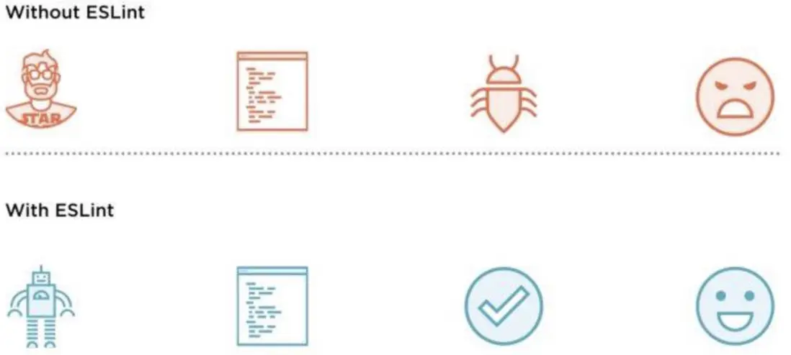
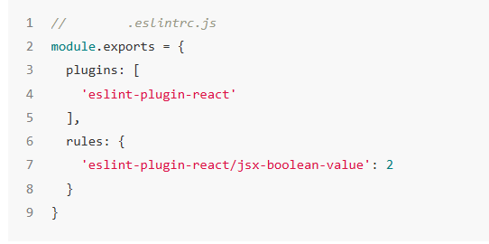
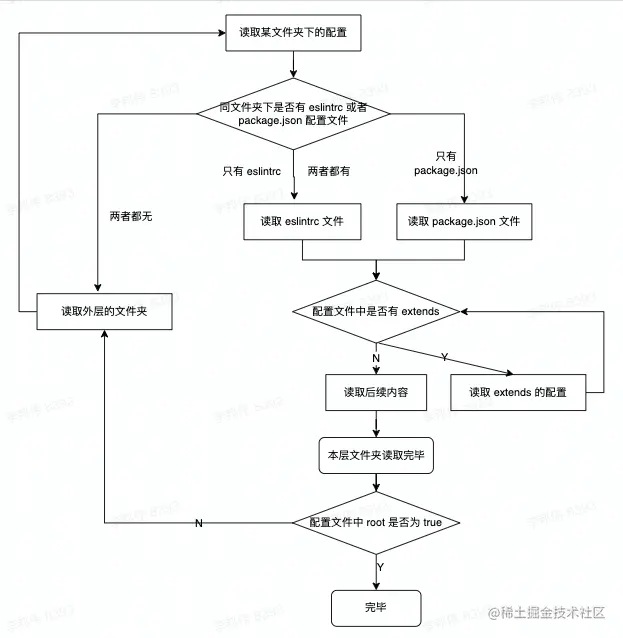
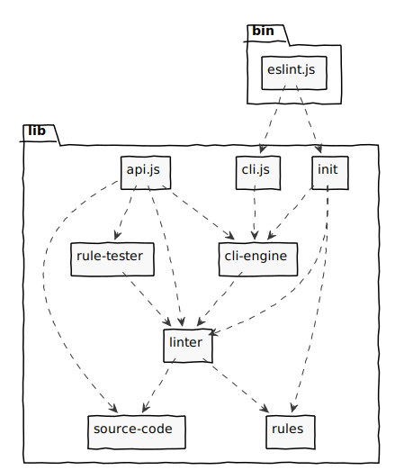
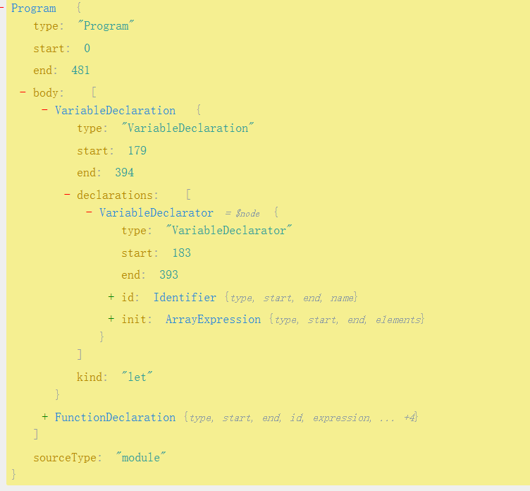

## Eslint 运行原理解析

### 为什么要用Eslint

- 没有Eslint，我们写的代码就需要人工检查，格式可能千奇百态，每个人都风格都有所区别，阅读代码自然也就没那么通顺了，那代码的可维护性就会大大降低，严重的可能会影响开发者的心情，甚至出现奇奇怪怪的BUG
- 但是项目里使用了Eslint规范，那每个人的代码格式将会被统一，运行起来自然少了很多问题，阅读别人代码时也会更加顺畅

### 你可能不常用的一些配置
回顾下Eslint配置， 官方为我们指出的可作为配置的文件如下，从上往下为优先级顺序
> .eslintrc.js
  .eslintrc.yaml
  .eslintrc.yml
  .eslintrc.json
  .eslintrc
  package.json

```javascript
module.exports = {
    root: true,
    extends: [
        'eslint:recommended',
        'plugin:vue/vue3-essential',
    ],
    plugins: ['vue'],
    parser: '',
    parserOptions: {},
    //...
}
```
- root 是否为根文件，若不是则会继续向上查找，由于eslint可支持层叠配置，因此寻找配置时会寻找所有父级的配置，然后合并成一个配置数组, 并根据这个配置数组生成一个最终配置，当子目录的配置与父目录的冲突时，会优先使用子目录的
- plugins 插件，eslint插件包名都是以eslint-plugin-[pluginName] 来命名的，这里填写了vue则表示会引入eslint-plugin-vue插件，而plugin引入后只会加载对应的配置，具体使用还需要用户自己来写

- extends 集成，简单来说就是 plugin + rules
- parser 解析器，eslint默认使用.，可指定不同解析器作为默认解析器，但必须满足规范
- parserOptions 解析器配置，简单来说就是自定义解析器时需要设置的配置

#### 配置合并流程


### 运行流程
官方eslint架构图


- lib/linter/ - 这个模块是核心的 Linter 类，它根据配置选项进行代码验证。这个文件不进行任何文件 I/O 操作，也不与控制台交互。对于其他需要验证 JavaScript 文本的 Node.js 程序，它们可以直接使用这个接口。

#### Lint校验整体流程大概如下：
1. 读取配置
2. 解析配置
3. 预处理：例如.vue就有自己的预处理器, 将文件分割成若干份子文件
4. 解析文件：将目标文件解析成对应的AST, 至于是什么AST跟传入的Parser有关系 
5. 执行校验规则，收集校验问题
6. 提示错误 & 修复错误

#### 什么是AST
抽象语法树 (Abstract Syntax Tree)，简称 AST，它是源代码语法结构的一种抽象表示。它以树状的形式表现编程语言的语法结构，树上的每个节点都表示源代码中的一种结构。


- [探索AST](https://astexplorer.net/)
- [小型编译器](https://github.com/jamiebuilds/the-super-tiny-compiler)

#### Eslint 是如何校验规则的
